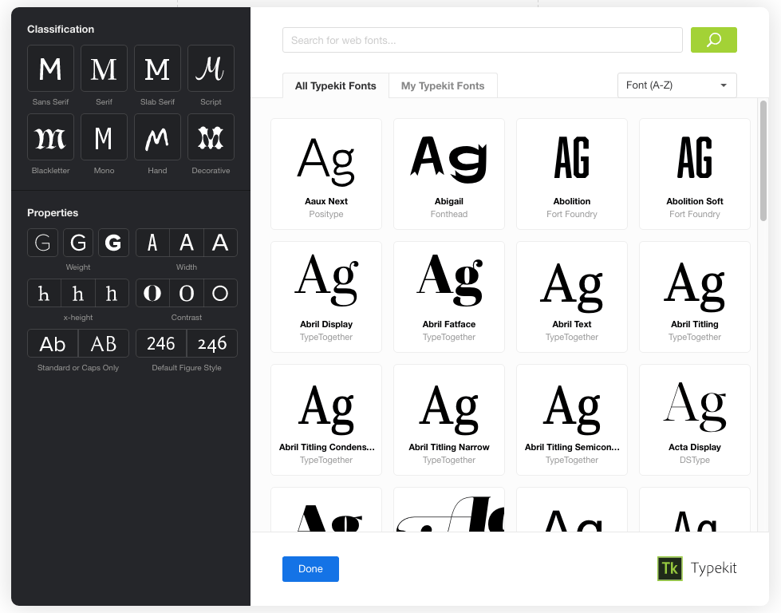

# filter-menu

**Many typefaces will not work for a project**.

Considering the breadth of typefaces available, and the needs of any particular project, many typefaces are not appropriate. Most likely, this is because they are not the right style, or because they don’t support necessary glyphs. So when someone is browsing for the right font, many inappropriate typefaces get in the way.

Filters exclude irrelevant typefaces, making browsing more productive. Enabling a filter hides all typefaces except those that match the filter criteria.

For example, let’s say we’re looking for a thin sans — a narrow one that might work well for headings. Activating the “Sans Serif”, “Condensed”, “Light”, and “High x-height” filters helps us browse for fonts that match these criteria, by hiding fonts that don’t match.

Therefore:

**Offer a variety of filters that limit the selection of fonts based on style and glyph support. Allow multiple filters to be active at the same time, amplifying their usefulness. Use filters as a way to reinforce people’s knowledge about type with icons and accurate labels**.

Filters should be a visually rich part of the [browse fonts](browse_fonts.md) interface. Besides being very helpful for the task of browsing, filters are a general reminder of the diverse characteristics of type. Part of the value of integrating Typekit is empowering people to make good typographic decisions, and knowledge about the diverse qualities of type is, as they say, power.

The filter menu looks great and works well when it is visible by default. However, it should not overpower the family cards. Filters can be collapsed within an icon or button if necessary, to make more space for family cards. If the filter menu content is too tall, let it scroll vertically.

Each filter should have an icon and a label to explain itself. [Typekit filter icon assets](https://platform-assets.typekit.net/filter-icons.svg) (SVG) are available. Active filters should be obvious, so people understand that the visible selection of fonts is being filtered.

Classification and Properties filters should be more prominent than Language support and OpenType feature support filters.

Most filters are mutually exclusive within their filter group. For example, you can use Classification filters to see “Slab Serif” fonts, or “Script” fonts, but you cannot see fonts that are classified as both “Slab Serif” and “Script” (there are no such fonts).
